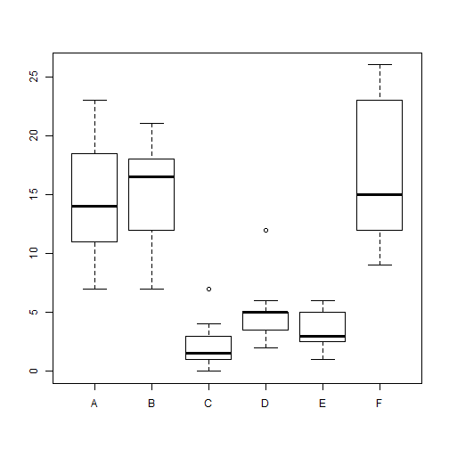

Project for Data Products
========================================================
author: Jason
date: Apr 24 2016

Data Question
========================================================

For this project I decided to use the InsectSprays dataset
found in the datasets library. 

The goal was to create a graph that would update when 
the pesticide spray was changed


The Data
========================================================
This is a very basic data set and includes 6 sprays and 12 trials for
each spray. The count was how many insects were found on the plant afterwards


```r
summary(InsectSprays)
```

```
     count       spray 
 Min.   : 0.00   A:12  
 1st Qu.: 3.00   B:12  
 Median : 7.00   C:12  
 Mean   : 9.50   D:12  
 3rd Qu.:14.25   E:12  
 Max.   :26.00   F:12  
```

Plot
========================================================
Here is a look at all the data on one graph as a box plot


Plot from site
========================================================= 
The plots on the site will subset the data based on the choice in the drop down box and display an
updated histogram based on the data.

You can find the project here https://jasonnewbury.shinyapps.io/App1/

Thank you!

